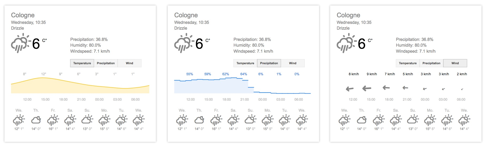

d3 weather visualization 
========================

Small implementation of a weather visualization based on temperature and rainfall data of a whole year. Inspired by the ZEIT article of raureif's [Weather Radials](http://www.weather-radials.com/) poster.

The following screenshot shows temperature and rainfall changes for the weather station cologne nippes of 2015.

[codepen.io Demo](http://codepen.io/anon/pen/wMdOzm)

The second visualization is inspired by Googles forecast visualization inside Google Search.

